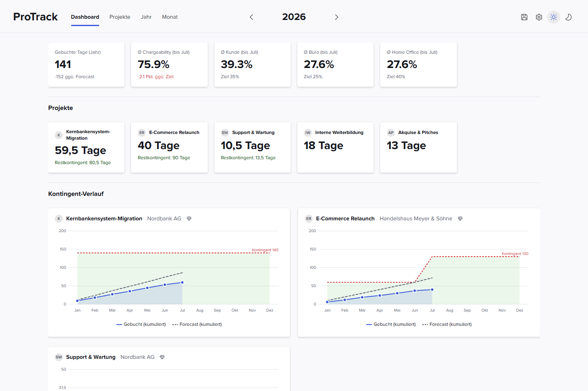
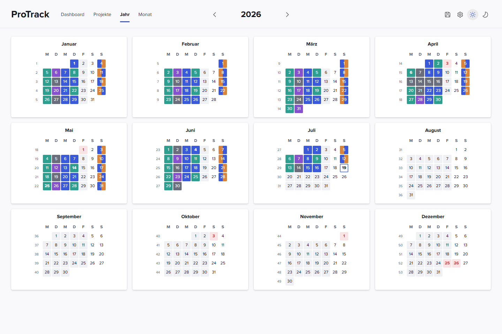
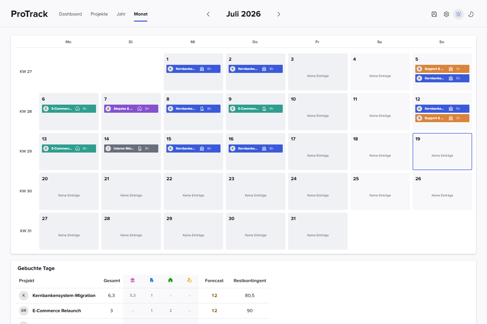
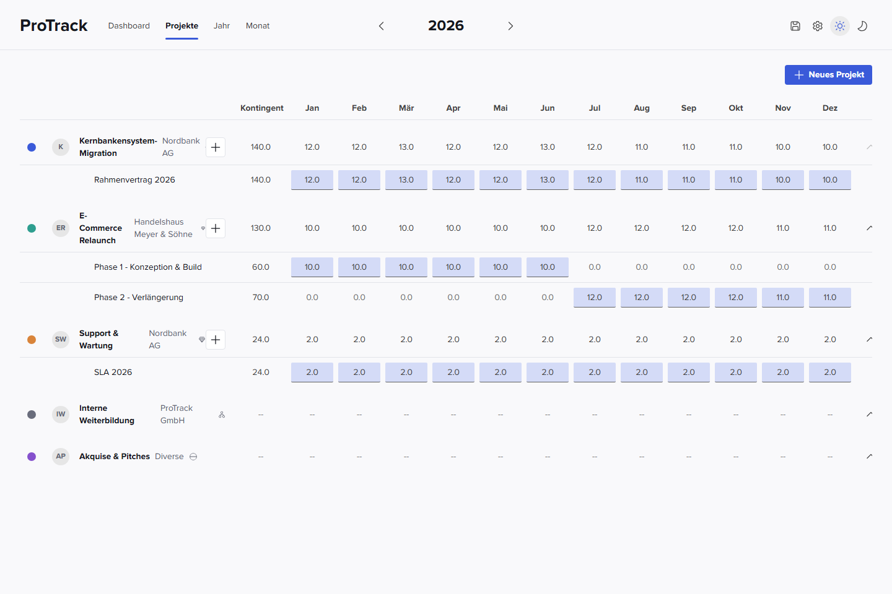
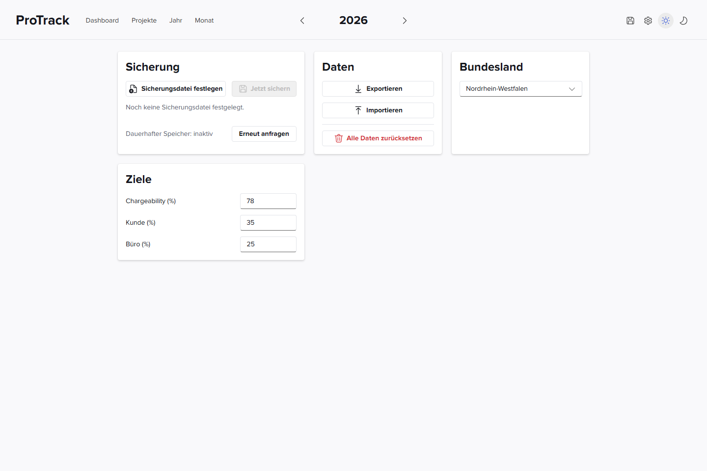

# ProTrack

Lokale Webapp zur Erfassung von Arbeitszeit über mehrere Kunden/Projekte hinweg: wie viele Tage
pro Projekt gebucht wurden, wie sich das gegen ein geplantes Kontingent und einen Forecast verhält,
und wie sich die Zeit auf Kunde/Büro/Home Office verteilt.

Alle Daten bleiben lokal im Browser (IndexedDB) - es gibt kein Backend. Als Ausgleich lässt sich
eine Sicherungsdatei festlegen, in die per Klick jederzeit der komplette Datenbestand geschrieben
werden kann (siehe [Einstellungen](#einstellungen)).

## Screenshots

Alle Screenshots zeigen die App mit realistischen Beispieldaten (mehrere Projekte, Buchungen über
mehrere Monate 2026) - keine Daten aus einem echten Projekt.

### Dashboard



Der Einstieg für "wie stehen wir da": KPI-Kacheln oben (gebuchte Tage, Ø Chargeability,
Ø Kunde/Büro/Home Office - jeweils gegen ein in den Einstellungen definiertes Ziel), darunter eine
Kachel pro Projekt mit Restkontingent, dann ein Burn-up-Chart je Projekt mit Kontingent (Kunden-Kontingent
im Zeitverlauf, gebucht vs. Forecast, kumuliert), und zuletzt zwei Chart-Paare für Chargeability und
Arbeitsort-Verteilung (Linienverlauf über die Monate + Zusammensetzung als gestapeltes Chart).

### Jahresansicht



Alle 12 Monate auf einen Blick, jeder Tag als Kachel eingefärbt nach Projekt (bzw. grau ohne Buchung,
rosa an Feiertagen - abhängig vom in den Einstellungen gewählten Bundesland). Dient als schneller
Überblick, welche Tage bereits erfasst sind und wo noch Lücken sind; ein Klick auf einen Monat springt
in die Monatsansicht.

### Monatsansicht



Der Kalender für die eigentliche Zeiterfassung: pro Tag lassen sich ein oder mehrere Projekte mit
Stunden und Arbeitsort (Kunde/Büro/Home Office/Abwesend) buchen. Ein Klick auf einen Tag öffnet den
"Aufwand verteilen"-Dialog, in dem sich Stunden auf mehrere Projekte am selben Tag aufteilen lassen.
Unterhalb des Kalenders fasst eine Tabelle den Monat pro Projekt zusammen: gebuchte Tage nach
Arbeitsort, Forecast und verbleibendes Kontingent.

### Projekte



Verwaltung der Projekte und ihrer Kontingente. Jedes Projekt hat einen Kunden, eine Farbe/ein Logo,
eine Verrechenbarkeits-Einstufung (verrechenbar/nicht verrechenbar/neutral) und optional ein oder
mehrere Kontingente (Tage-Budget mit Gültigkeitszeitraum, z. B. bei einer Vertragsverlängerung
mitten im Jahr). Für jedes Kontingent lässt sich der Forecast direkt in der Monatsspalte editieren -
das treibt die Burn-up-Charts im Dashboard. Projekte ohne festes Kontingent (z. B. interne
Weiterbildung) werden als "--" geführt und tauchen nicht im Kontingent-Verlauf auf.

### Einstellungen



- **Sicherung**: Datei festlegen (File System Access API) und den kompletten Datenbestand per Klick
  dorthin schreiben - der einzige Weg, Daten aus der lokalen IndexedDB "nach außen" zu bekommen.
- **Daten**: Export/Import als JSON sowie ein kompletter Reset.
- **Bundesland**: bestimmt, welche Feiertage in Jahres-/Monatsansicht berücksichtigt werden.
- **Ziele**: Zielwerte für Chargeability sowie den Kunde-/Büro-Anteil (Home Office ergibt sich aus
  dem Rest) - das sind die Referenzlinien in den Dashboard-Charts.

Alle Einstellungen sind pro Jahr gespeichert; ein Jahr ohne eigene Einstellungen erbt automatisch
vom letzten Jahr mit expliziten Werten.

## Tech-Stack

- React 19 + TypeScript, gebaut mit Vite
- Fluent UI v9 (`@fluentui/react-components`) als Komponenten- und Design-System
- IndexedDB (über `idb`) als einzige Datenhaltung - vollständig offline-fähig, als installierbare PWA
- Manuelle Sicherung/Export/Import als JSON, keine Server-Komponente

## Entwicklung

```bash
npm install
npm run dev       # Dev-Server
npm run build     # Typecheck + Produktionsbuild
npm run lint      # Oxlint
```

## Projektstruktur

```
src/
  pages/         # Dashboard, Jahr, Monat, Projekte, Einstellungen
  components/    # UI-Komponenten (Charts, Dialoge, Kalender, ...)
  hooks/         # Datenzugriff (Projekte, Buchungen, Jahreseinstellungen)
  db/            # IndexedDB-Schema und -Zugriff (idb)
  types/         # Domänenmodelle (Project, DayAssignment, YearSettings, ...)
  theme/         # Light/Dark-Theme, Farbpalette
  utils/         # Kalender-/Feiertagslogik, Dashboard-Aggregation, Backup
```
